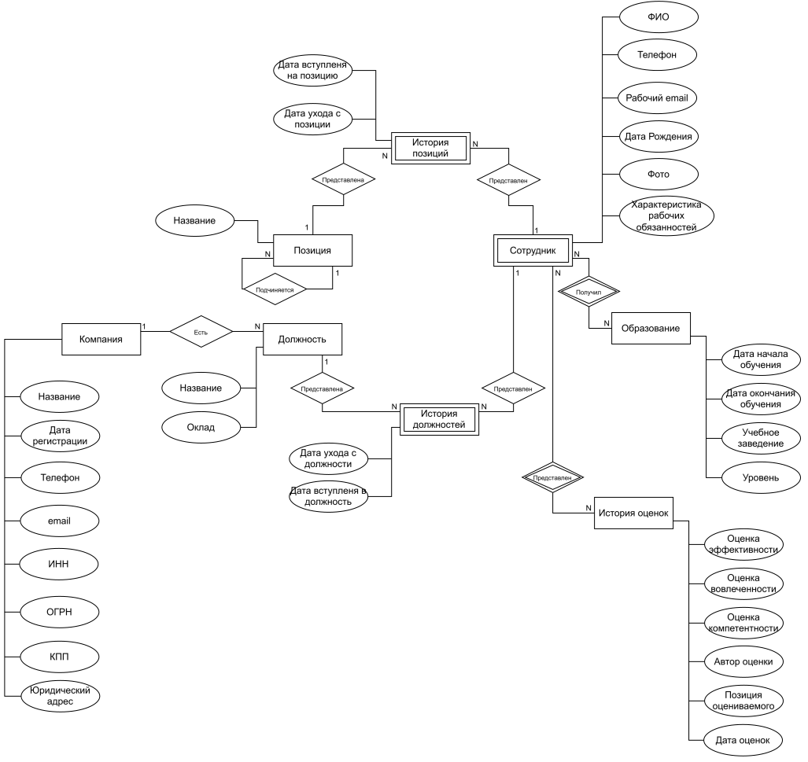

# Приложение для хранения и обработки оценок трудовой эффективности сотрудников группы компаний.

## Краткое описание

Веб-приложение, позволяющее просматривать данные о сотрудниках и компаниях группы. Данные о сотрудниках
содержат их позицию и должности в различных компаниях группы, ранее выставленные оценки эффективности, сведения об
образовании, персональные данные. Доступ к данным сотрудников предоставляется только вышестоящим сотрудникам, выставлять
оценки может только непосредственный руководитель.

## Предметная область

Предметная область - администрирование и учет показателей эффективности сотрудников. В качестве показателей
эффективности выбраны: непосредственно эффективность в смысле отношения результата к затраченным ресурсам;
вовлеченность; компетенции сотрудника.

Предметная область включает в себя следующие основные сущности:

* сотрудник:
    * ФИО;
    * телефон;
    * рабочий email;
    * дата рождения;
    * возраст, как вычисляемое поле;
    * фото;
    * характеристика рабочих обязанностей;
* образование:
    * дата окончания обучения;
    * учебное заведение;
    * уровень образования;
    * направление подготовки;
* позиция:
    * название;
* должность:
    * название;
    * оклад;
* компания:
    * название;
    * дата регистрации;
    * телефон;
    * email;
    * ИНН;
    * ОГРН;
    * КПП;
    * юридический адрес;
* история изменения оценок сотрудника:
    * оценка эффективности;
    * оценка вовлеченности;
    * оценка компетенций;
    * автор оценки;
    * позиция оцениваемого;
    * дата оценивания;
* история изменения позиции сотрудника:
    * дата вступления на позицию;
    * дата ухода с позиции;
* история изменения должности сотрудника:
    * дата вступления в должность;
    * дата ухода с должности.

## Роли

Кроме того для доступа к системе можно выделить следующие роли:

* гость - неавторизованный пользователь, который может просматривать информацию о позициях и компаниях без возможности
  их редактирования;
* сотрудник - может просматривать информацию о сотрудниках на той же позиции и всех своих подчиненных, выставлять оценки
  непосредственным подчиненным, обладает доступом к информации о компаниях в которых он устроен, своей позиции и
  должности, а также всех нижестоящих должностях и позициях своих подчиненных;
* администратор - осуществлет контроль и управление работой системы, добавляет и редактирует информацию о пользователях,
  компаниях, должностях и позициях.

## Анализ аналогичных решений

Краткий анализ существующих решений в данной предметной области представлен в таблице:

| Система    | Оценка эффеткивности | Оценка вовлечености | Оценка компетенций |
|------------|----------------------|---------------------|--------------------|
| Happy Job  | -                    | +                   | -                  |
| Jinn       | -                    | +                   | $\pm$              |
| iSpring    | -                    | +                   | +                  |
| StartExam  | -                    | -                   | $\pm$              |
| Proaction  | -                    | -                   | $\pm$              |
| Redmine    | +                    | -                   | -                  |
| Jira       | +                    | -                   | -                  |
| ToolKeeper | +                    | -                   | -                  |

$\pm$ подразумевает оценку компетенций посредством тестирования, что не всегда достаточно в полной мере.

## Целесообразность и актуальность

Как видно не существует единого сервиса, позволяющего хранить и обрабатывать оценки сотрудников по сформулированным
критериям. При этом существует множество сервисов, позволяющих оценивать отдельные аспекты. Таким образом у компаний
может возникнуть необходимость держать всю информацию полученную в отдельных сервисах в едином месте, с привязкой к
сотрудникам и их карьерному пути.

## Use-Case-диаграмма

## ER-диаграмма

